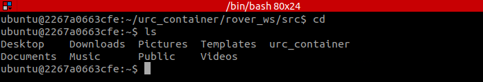

# Linux

## Background

Linux is an open-source operating system generally used for servers, embedded systems, and software development. It is similar to
macOS thanks to their common roots in Unix.

Linux comes in many different distros, which change significant portions of the OS. This includes everything from the GUI the user interacts with
to the tools the user uses to install software (package managers)

Some popular distros include:
- Ubuntu
- Arch
- Fedora

Linux is comprised of files and folders (called directories) all stemming from one base directory called `\` or `root`. Folders are repeatedly nested
to segment off areas of the operating system to make navigation easier

## ROS2

While ROS2 does not technically need to run on Linux, almost all community support and outside packages depend on a Ubuntu environment.

As such, RoboJackets has all members work in a Linux environment. The setup instructions make it clear you don't need to have Linux as your primary operating system
though, as excellent alternatives like Docker, Virtual Machines (VMs), dual-booting, and Windows Subsystem for Linux (WSL) exist.

## Using and Navigating the Terminal

The terminal is an essential part of using any Linux distro. It enables you to enter commands and execute programs that might not have an associated GUI.

#### 1. Open up Terminator

#### 2. Enter `ls`

You should see a list of directories like the photo below. `ls` tells you the files in your current directory, helpful for finding things
and getting a sense of where you are

#### 3. Enter `cd <name-of-one-of-the-dirs-seen>`

- `cd` changes your current directory. **You can hit tab to automatically fill in the rest of the directory name once you've typed enough!**
- `cd` can be used like `cd dir1/dir2/dir3` to jump ahead several directories at once
- `cd` on its own will take you to the home directory, usually the place you spend the most time and put the most files
- `cd /` will take you to root, and also enables root-relative nested `cd` calls

If you enter `ls` now, you will see the files in the new directory

#### 4. Enter `pwd`

`pwd` tells you the current path to where you are, useful for navigating with `cd`

#### 5. Enter `cd ..`

`cd ..` makes you go back one directory, to where you originally where. It can be nested like `cd ../../..` to go back multiple at once

#### 6. Enter `mkdir Test`. Enter `ls` to verify you now see a directory called test

`mkdir` is used to make new directories

#### 7. Enter `rm -rf Test` or `rmdir` to remove `Test`. Enter `ls` to verify your changes

- `rmdir` is used for empty non-nested directories
- `rm -rf` is a dangerous operation that deletes the directory and all things nested within it. **Careful using it!**

#### 8. Enter `ls -a`

Flags like `-a` can enhance certain commands. Now `ls` outputs hidden files (all files that start with `.`)

#### 9. Enter `man ls` or `ls --help`

`man` or `--help` will output a list of flags you can use for a given command, as well as explain how to use it.
**This is very helpful if you forget a minor flag or need to check documentation**

#### 10. Enter `clear`

`clear` wipes your screen and is useful for avoiding a cluttered terminal

#### 11. Navigate to directory containing a file and enter `cat <FILENAME>`

`cat` outputs the contents of a file to your screen

#### 12. Create a new text file with `touch test.txt`

#### 13. Run `echo 'Testing' > test.txt`. Verify the new text is present

`echo` is used to output text or a variable to terminal, in this case `Testing`

`>` is used to pipe the output of that echo command to `test.txt`. Piping is an advanced Linux concept, but essentially
boils down to sending the output of one command to another command in a direct chain

#### 14. Run `rm test.txt`. Verify it has been deleted

#### 15. Run `echo $PATH`

`$` is always appended to variables in bash

`$PATH` is another advanced Linux concept. Linux checks certain places when you run programs. By adding things to the `$PATH`, you gurantee that Linux
will also check those places for programs. This is how ROS2 is able to function when you install external libraries, as it simply has them in a 
path-accessible location (`/opt/ros/<version-name>/bin`)

#### 16. Try to install terminator (a bash shell you are likely using) with `apt-get install terminator`. **This will fail since you are not root!**

#### 17. Give yourself greater permissions by entering `sudo apt-get install terminator` instead

- apt, apt-get, and snap are all package managers on Ubuntu
- You use them to easily manage software installations

