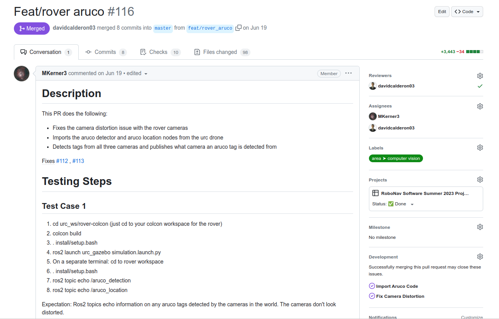
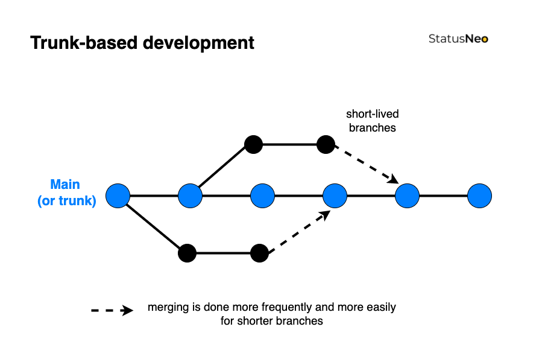
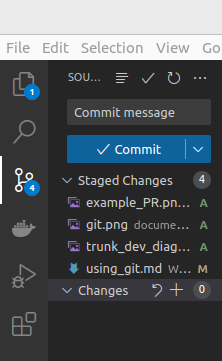
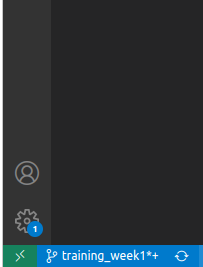

# Git

## Background

One of the biggest challeges with software development is source control, also known as the management of
changes on a given project.

Imagine you and your friends are all trying to code a project for a class. You keep making changes, but integrating your changes
becomes awkward. You have to resort to sharing the files on Discord to establish the newest version, you might do work that your friend already
did but did not share, and you don't have any easy way to track the history of what has been done.

What if there was a software that could automatically handle these tasks for developers?

## Enter Git!

Git is a version control software that enables seamless collaboration and tracking for projects, which Git calls repositories.

It does this through 4 main features:

- Branches: Seperate tracking for specific features, that can later be combined (merged) back into the main branch

- Commits: Storing your changes for a specific branch

- Pushes: Make your commits for a branch public

- Pulls: Updating your data based on the public changes others have made

## GitHub/GitLab

Git is usually paired with GitHub or GitLab, cloud hosting services that make easy sharing and managment of repositories possible.
They also offer addtional features like merge or pull requests, which are seamless ways to combine two branches without having to
do any advanced Git operations.

You can see a sample PR below. It contains a description of changes made and requires others to sign off on what you have done before anything can
be merged into the main branch

## Trunk-based Development

Trunk-based development is generally seen as the best-practice way to develop using Git, and is generally the preferred way to do things in industry
as well as in RoboJackets.

The general strategy for adding a new feature:
1. Make an issue on GitHub for your feature
2. Make a branch for your feature
3. Commit all your changes on that one branch
4. Once your feature is complete, create a pull request on GitHub
5. Close the issue once your pull request is merged

## How to Use Git

You will be using Git to track your changes during software training, and to help you familiarize yourself with it for the future.

1. Open up VS Code or your editor of choice with Git integrations

2. Open up `rj_training_container/training_ws/src`

3. Make sure you have the newest branch data with `git fetch`

4. List all current branches with `git branch` in terminal

5. Make a branch called `git branch <student>-<first_name>-<last_name>`

6. Check that branch out with `git checkout <student>-<first_name>-<last_name>`

Any changes you now make will only be contained in your specific branch!

7. Changes can be committed by going to source control in VS Code, clicking + on anything you want to add, then writing a commit message

8. Fetch and push changes by clicking on the refresh icon in the bottom left

