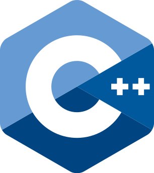
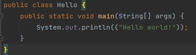
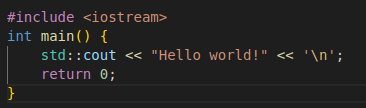
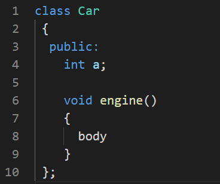

## C++



C++ is a programming lanugage that allows significant control over resources and performance, in exchange
for being harder to read and write. It is the langauge backbone of most performance-intensive projects

### Use Cases:
- robotics
- embedded systems
- operating systems
- computer vision

### Characteristics:
- Strongly-typed = similar to Java, variables have explicit types (like int) you must take into account
- General-purpose = similar to Python, no conventions like Object-Oriented Programming are forced
- Compiled = must be compiled in machine-readable code before running


## Hello world in Java vs C++





## Includes and Macros

C++ and C have the ability to write macros using `#some statement`. This can be used to arbritrarily change things in your code on it is compilied.

In C++, you can use this to access code outside your current file by writing `#include "desired_file.hpp"` at the top. It will put the content of that file into your current at compile time

It can also be used to access libraries like `iostream` by writing `#include <library_name>`

## Classes

C++ has classes that are almost identical to Java. You have public/private elements, methods, and constructors



## How to Compile and Run the C++ Demos Today

Navigate inside `/src` in the Week 2 folder in bash, then run...
```bash
g++ <file_name>.cpp
./a.out
```

