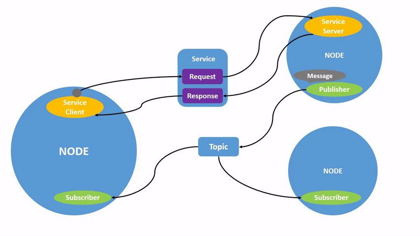

# ROS Basics: Nodes, Messages, and Topics

A ROS system can be thought of as a distributed system that can be visualized as a **graph**. 

Each **node** in this graph is a "subsystem" that is responsible for a *single, modular* purpose (for example, publishing data from a joystick).
Each node can send and receive data (called **messages**). A full robotic system may contain *many* nodes processing data simultaneously.

Nodes exchange messages via named **topics**. A node may publish and subscribe to any number of topics simultaneously. For this reason, we call say that topics support "many-to-many" communication. 

Let's use an (imperfect) analogy to understand this. You can think of radio transmitters as ROS 2 nodes, and radio frequencies as topics. Just like how a radio transmitter broadcasts a signal to a specific frequency, a ROS 2 node publishes messages to a specific topic. And just like how a radio receiver can tune in to a specific frequency to receive the signal, a ROS 2 node can subscribe to a specific topic to receive messages. Multiple nodes can publish and subscribe to the same topic, just like how multiple radio transmitters can broadcast to the same frequency and multiple receivers can tune in to that frequency to receive the signal.

> If you want to learn how to write a simple publisher/subscriber in C++, [this](https://docs.ros.org/en/humble/Tutorials/Beginner-Client-Libraries/Writing-A-Simple-Cpp-Publisher-And-Subscriber.html) is a great resource!

> Of course, there's a lot more to ROS. More than we can cover in a single training. There's services, actions, transforms, etc. You will learn about these with experience. However, if you'd like to learn these more formally, the [ROS 2 documentation](https://docs.ros.org/en/humble/index.html) is the de facto place to look.