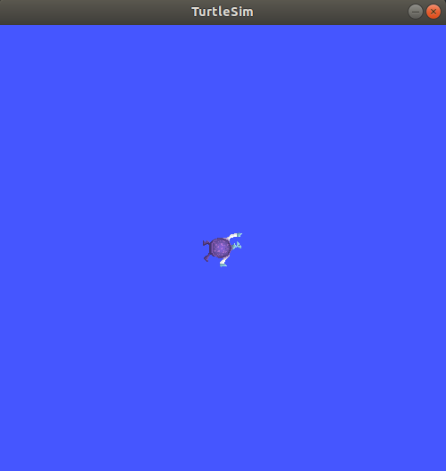

# ROS Basics: Project!

Alright! Now that you're familiar with some of the concepts, it's time to get our hands dirty with a mini project. We'll be using the [turtlesim](https://docs.ros.org/en/humble/Tutorials/Beginner-CLI-Tools/Introducing-Turtlesim/Introducing-Turtlesim.html) environment.

Make sure that turtlesim is installed on your computer by running `sudo apt update` and `sudo apt install ros-humble-turtlesim`. To start turtlesim, run `ros2 run turtlesim turtlesim_node`. You should see a simulator window with a turtle in the center like this!

Let's make this turtle move! You'll be working instead `turtlesim_project`. Notice that we've provided you with a `keyboard` package that contains a node that publishes key presses. We want you to write a node that translates these key presses into command velocities that will be used to move the turtle around. 

Open `teleop/src/key_to_twist.cpp`. You will be writing your code in the `keyPressCallback` function. Read the comments carefully to see what needs to be done!

After you finish coding, follow these steps to run your code.
1. Run `colcon build` at the project's root directory to build the packages.
2. Run `source install/setup.bash` to source the generated setup files. 
3. Open three terminal windows. Remember to run `source install/setup.bash` in each window! In the first window, launch turtle sim by running `ros2 run turtlesim turtlesim_node`. In the second window, launch the keyboard node by running `ros2 run keyboard keystroke_listen`. In the third window, launch your `key_to_twist` node by running `ros2 run teleop key_to_twist`.