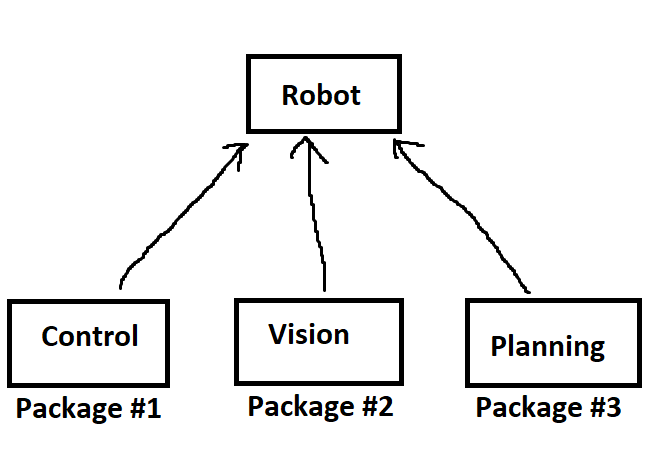
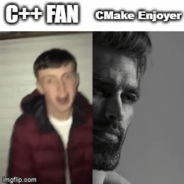

# CMake

While you can compile your C++ code on your system and simply download any files you need manually when developing on your own, this introduces lots of
issues when scaling your work to a team. They would have to duplicate your exact setup, which introduces significant onboarding challenges, risk of devs
getting out of sync, and a complete incompability with other operating systems.

CMake was designed to fix those problems. It is capable of...
1. Scanning for external dependencies
2. Efficiently compiling and linking many C++ files at once
3. Running tests
4. Working on many different platforms

Working with CMake is hard, but there is no way to avoid it. **Getting CMake and everything that sets up ROS2 nodes to run is what seperates a weak ROS2 programmer
from someone capable of adding brand-new functionality on their own**

## Colcon

Packages are a modern way of bundling software, where you cluster several related pieces of code into a small groups. These packages of code can then
be used together to form grander projects, as seen in the example below. This helps your code be more readable and modular overall, so nearly every
language nowdays has adapted the concept.

Advantages of using Colcon:
1. Avoids issues stemming from packages that use other packages being built first (no chicken-and-the-egg problem)
2. Faster build times
3. Useful testing suites built in

## Yet Another Massive W for the CMake Community

