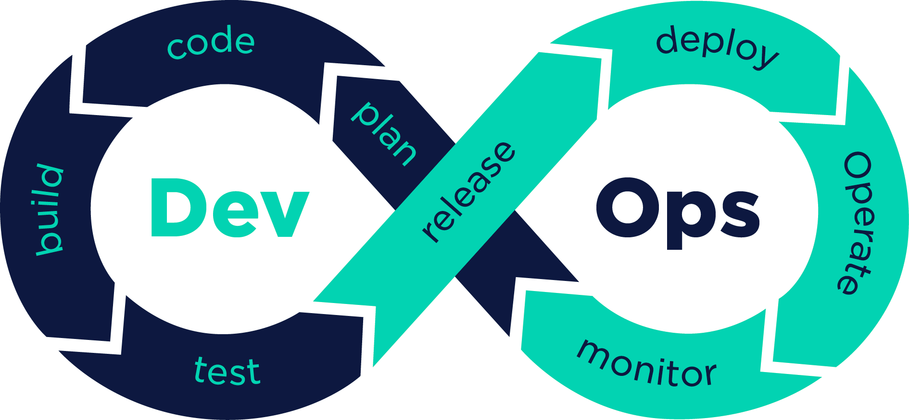
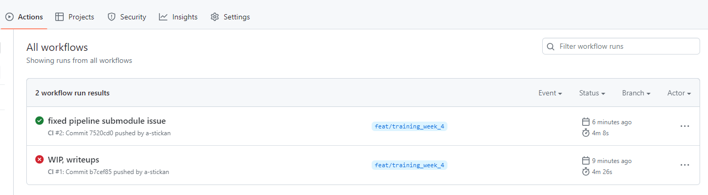
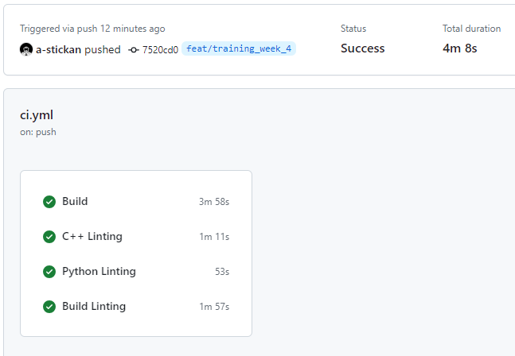

# DevOps

Writing code is a major part of software development, without testing that code could potentially be incorrect and harmful to
a project as a whole. While having people replicate issues on their own system and try to is a valid approach, it has been largely
replaced by a new methodology to testing known as DevOps.

DevOps is a major subfield of software engineering that centers around increasing the speed and quality of changes to projects through automation
and effective management.

Some DevOps practices in place at RoboJackets:
1. Use of CI/CD tools like GitHub Actions or CircleCI to automate testing
2. Automated ROS2 Unit tests to verify the correctness of new code
3. Integration testing to verify new code works with old code
4. Agile project management

## CI/CD Testing

Continous integration and continous deployment (CI/CD) testing is centered around the idea of building automated testing infrastructure that
can run a variety of tests on your code on a fresh system to verify that it works. It allows easy verification that code works.

Some of the tests we use include:
1. Making sure your code builds
2. Checking your code's adherence to the style guidelines
3. Checking your code against any unit tests

You can actually check the status of the code in your branch commits in our repo thanks to CI/CD! Proceed to the Actions tab at the top of GitHub, and
filter the workflow runs by your branch name

Click on any of the pushes you made to see their pipeline progress. Click on any of the individual jobs to see the tests running progress and the failure
details if applicable. 

## Test-Driven Development

Test-driven development (TDD) is about developing tests before or during the process of writing code. It can help you know if your code is compliant
during the process of development, and plays very well with CI/CD patterns. You will be using TDD during the coding exercises today.