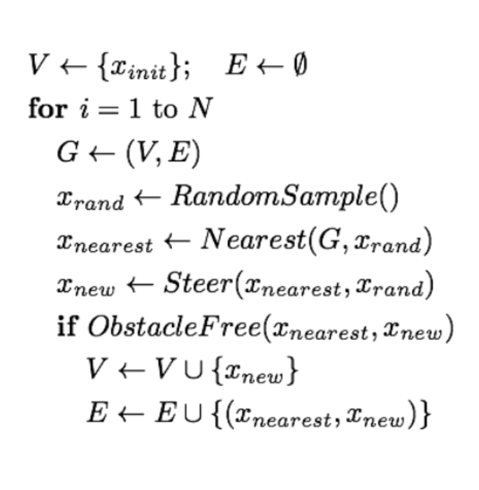

<!--
STOP
We strongly recommend viewing this file with a rendered markdown viewer. You can do this by:
 - Opening this file in the GitHub web viewer
 - Pressing Ctrl+Shift+V in Visual Studio Code
 - Opening this file in any other markdown viewer you prefer
-->

# Week 9 Project: Rapidly Exploring Random Trees (RRT)

- choose a random point
- find the nearest node in the tree
- create new node Steer(x_nearest, x_rand)
    - if distance is greater than limit pick node of max distance along said line
- if line is obstacle free then add node to the tree

